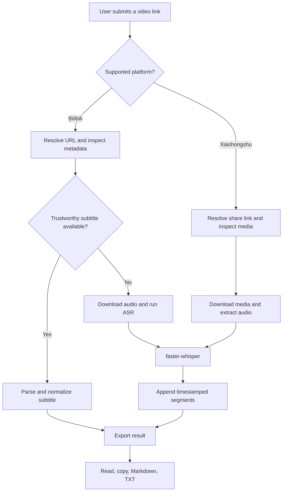
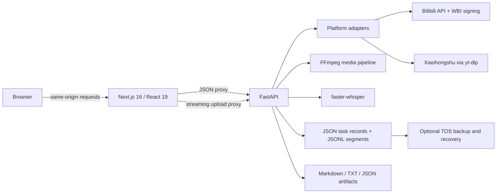

# Link2Transcript

**Turn Bilibili videos and Xiaohongshu posts into readable, downloadable transcripts.**

[中文](README_ZH.md) · [Live demo](https://ssam70taea5thtgh9v9q5.apigateway-cn-beijing.volceapi.com) · [Product requirements](docs/PRD.md)

Link2Transcript is an AI-assisted transcription product built around one promise: a user should be able to submit a supported video link, understand what the system is doing, read partial progress, and leave with a usable transcript.

The transcript is not the end product—it becomes a reusable context layer for conversations with AI, deeper analysis, questions, and further thinking.

It does not force every input through speech recognition. It first looks for trustworthy subtitles, falls back to server-side ASR only when needed, and makes the chosen processing method visible to the user.

> Product role: problem definition, scope, workflow design, trade-offs, acceptance criteria, and iteration. Implementation was developed with AI coding assistance against staged product and technical documents.

## Why I Built This

Getting text from a video is rarely a single-step task. Users may need to export platform subtitles, download media, extract audio, wait for speech recognition, clean timestamps, and convert the result into a reusable format. Long-running jobs create another problem: users cannot tell whether the system is working, stuck, or safe to close.

The V1 question was therefore not “Can a model transcribe audio?” but:

> Can a non-technical user move reliably from a supported video link to a readable, downloadable transcript—with the route, progress, failure state, and limitations made clear?

## Product Experience

1. Paste a Bilibili link, a Xiaohongshu link, or the full share text containing that link.
2. The system validates the source and selects the lowest-cost reliable route.
3. Progress and transcript segments appear incrementally. The task can be cancelled without discarding text already produced.
4. A completed transcript can be read, copied, or downloaded as Markdown or TXT.

| Input | Current behavior |
| --- | --- |
| Bilibili single video / selected episode | Validate → prefer trusted subtitles → ASR fallback |
| Xiaohongshu video note | Resolve share link → download media → extract audio → transcribe |
| Douyin, playlists, multi-output collections | Explicitly out of scope for the current release |

The hosted product accepts link input only. A local-upload path remains implemented and tested for local/self-hosted deployments, but it is disabled in the current live demo because the deployment gateway limits synchronous request bodies.

## Workflow Design



This is a deterministic workflow with explicit branches and failure rules—not an autonomous Agent loop.

## Product Decisions and Trade-offs

### 1. Subtitle first; speech recognition as fallback

Bilibili often already has human or platform-generated subtitles. Reusing them avoids unnecessary compute and waiting. In recorded acceptance testing, a 15-minute video completed via subtitle extraction in **1.27 seconds**, while ASR took several minutes.

The product still exposes the actual route—human subtitle, AI subtitle, or speech recognition—because users should know how the transcript was produced.

Subtitle availability alone is not enough. Real testing found that a platform endpoint could return subtitles for the wrong video. The Bilibili adapter therefore checks duration coverage and segment uniqueness before trusting a subtitle; suspicious results fall back to ASR.

### 2. Cost is gated by duration, not only file size

Transcription cost grows mainly with media duration. The system inspects metadata before downloading when possible and applies a configurable duration limit (two hours by default). File size remains a safety limit, not the primary product rule.

### 3. Long jobs show progress and preserve work

ASR segments are appended to JSONL as soon as they are produced. The UI fetches only new segments with a cursor, so a page refresh or process interruption does not erase completed work.

For content longer than 20 minutes, the backend uses fixed windows with a five-second overlap and timestamp-based deduplication. This bounds memory use while avoiding a fragile dependency on silence detection—an approach that failed on videos with continuous background music.

### 4. Partial text is readable, but not downloadable as a “complete” artifact

Failed and cancelled tasks retain generated segments for inspection. They do not receive Markdown/TXT/result artifacts. This prevents an incomplete transcript from being mistaken for a finished deliverable.

### 5. User-facing failures must suggest the next action

Platform restrictions, missing audio, silent content, oversized inputs, invalid links, and incomplete downloads have explicit Chinese messages. Internal stack traces, credentials, and raw dependency errors stay out of the UI.

## AI and Technical Design

### What is actually AI-powered

The runtime AI capability is **automatic speech recognition through `faster-whisper`** (`small`, CPU, `int8` by default). The core product does not call GPT, Claude, DeepSeek, or another LLM; it has no RAG pipeline, autonomous planning, memory system, or sub-agent orchestration.

`skill/SKILL.md` documents the intended routing and fallback policy for development and reuse. It is not loaded by the application at runtime—the executable behavior lives in the FastAPI service layer.

Text post-processing is deliberately narrow and deterministic: Traditional Chinese is converted to Simplified Chinese and a small set of verified recurring errors is normalized. The system does not perform LLM rewriting that could silently change meaning.

### Architecture



| Layer | Implementation | Why |
| --- | --- | --- |
| Frontend | Next.js 16, React 19, strict TypeScript, Tailwind CSS v4, zod | Typed UI, runtime API validation, same-origin deployment |
| API and orchestration | Python 3.11/3.12, FastAPI, Pydantic v2 | Strong request/state contracts and access to the media/ASR ecosystem |
| Platform handling | Bilibili API with WBI signing; yt-dlp for Xiaohongshu and fallback paths | Avoids Bilibili HTML 412 failures in data centers while isolating platform-specific behavior |
| Media | FFmpeg via `imageio-ffmpeg` | Normalizes inputs to 16 kHz mono audio and supports window slicing |
| ASR | faster-whisper | Local inference without an external model API |
| Persistence | Atomic JSON task records, append-only JSONL segments, optional Volcengine TOS | Simple local authority with cloud recovery, without adding a database before it is needed |
| Deployment | Volcengine veFaaS, API Gateway, TOS | Separate frontend/backend functions with recoverable task data |

## State, Recovery, and Boundaries

Tasks move through an explicit state machine:

```text
pending → checking_subtitle → [downloading_audio → transcribing] → exporting → succeeded

Any non-terminal state may become failed or cancelled.
```

- Each segment is flushed to disk immediately; aggregate task progress is persisted on a short interval to avoid write amplification.
- The recovery checkpoint is the maximum end timestamp in persisted segments, avoiding a second competing checkpoint file.
- Resume starts slightly before the checkpoint and discards overlap by timestamp.
- The backend cross-checks downloaded audio duration against platform metadata to reject silent truncation or preview-only media.
- Short-link redirects are allowlisted again after resolution to reduce open-redirect/SSRF risk.
- A single worker is intentional for the current deployment; simultaneous tasks queue and the UI exposes queue position.

## Validation and Iteration

The project was developed in stages: PRD → technical fit → local core loop → platform route → progressive feedback/recovery → production UI → platform expansion → cloud deployment.

Automated verification on the current codebase:

```text
Backend: 255 pytest cases passed
Frontend: typecheck + lint + 52 Vitest cases + production build passed
```

Selected real-material acceptance evidence:

| Scenario | Observed result |
| --- | --- |
| Retained local/self-hosted upload path—not enabled in the live demo | 61.1 s video → 37 segments → Markdown/TXT, completed in 19.5 s on the local test environment |
| Long-content validation of the retained local path | 1.05-hour audio → 2,007 segments; persisted, API, and exported counts matched |
| Bilibili with usable subtitles | 15-minute video completed in 1.27 s without ASR |
| Forced process termination during ASR | Restart resumed from persisted segments; overlap produced no duplicate segments in the recorded acceptance case |
| Xiaohongshu | 150.9 s → 54 segments; a 1,365 s sample → 480 segments in about 13 minutes in recorded cloud acceptance |
| Silent audio / video without audio | Explicit failure, zero downloadable artifacts |

The distinction matters: automated tests protect contracts and regressions; real media reveals integration failures such as platform anti-bot behavior, wrong subtitle payloads, memory pressure, upload proxy limits, and credential expiry.

## Current Limits

- Supported platforms: Bilibili and Xiaohongshu. Douyin is not supported.
- The hosted demo accepts links only. Local upload is implemented for local/self-hosted use but is not available in the current online product.
- Bilibili subtitle extraction depends on a valid server-side session. When it expires, the workflow automatically falls back to ASR, so the task can still continue, but processing takes significantly longer.
- Single-item workflow only; playlists and multi-output collections are not modeled.
- Burned-in subtitles require OCR and are not extracted.
- No speaker diarization, translation, summarization, or semantic transcript rewriting.
- Default maximum duration is two hours and can be configured.
- Xiaohongshu media extraction may require its own valid platform cookie on cloud/data-center networks. This dependency is separate from the Bilibili subtitle session, and platform changes can break extraction.
- The first ASR request may be slower while the model is downloaded or warmed.
- Single-worker scheduling is suitable for the current portfolio/demo scale, not high-concurrency production traffic.

## Roadmap

- Validate mobile layout on more physical devices.
- Add clearer quality signals and optional manual transcript correction.
- Improve service-level rate limiting and multi-worker scheduling only when usage justifies the complexity.
- Evaluate OCR, speaker diarization, and downstream summarization as separate capabilities rather than silently expanding the core transcript contract.
- Continue turning production incidents into repeatable acceptance cases and regression tests.

## Run Locally

Requirements: Python 3.11+, Node.js 20+, and network access for platform URLs. FFmpeg is provided through `imageio-ffmpeg`.

### Backend

```bash
python -m venv .venv
.venv/bin/pip install -e .
cp .env.example .env
.venv/bin/uvicorn backend.app.main:app --port 8000
```

API docs: `http://127.0.0.1:8000/docs`

### Frontend

```bash
cd frontend
npm install
cp .env.example .env.local
npm run build
npm start
```

Product UI: `http://127.0.0.1:3100`

### Verification

```bash
.venv/bin/pytest
cd frontend && npm run verify
```

Platform cookies and cloud credentials are optional server-side environment variables. Never place them in frontend code, logs, or version control.

## Repository Guide

```text
backend/app/api/        Task creation, status, segments, cancellation, downloads
backend/app/services/   Workflow, platforms, media, ASR, persistence, export
backend/tests/          255 backend tests
frontend/src/           Product UI, API client, polling, runtime validation
frontend/tests/         52 frontend tests
docs/PRD.md             Public product definition and acceptance criteria
skill/SKILL.md          Human-readable routing/fallback specification; not runtime-loaded
```

## Responsible Use

This is a personal portfolio and technical research project. Use it only for content you are permitted to process, follow platform terms and copyright rules, and do not use it for bulk scraping. Platform extraction depends on third-party behavior and may require maintenance.

MIT License.
