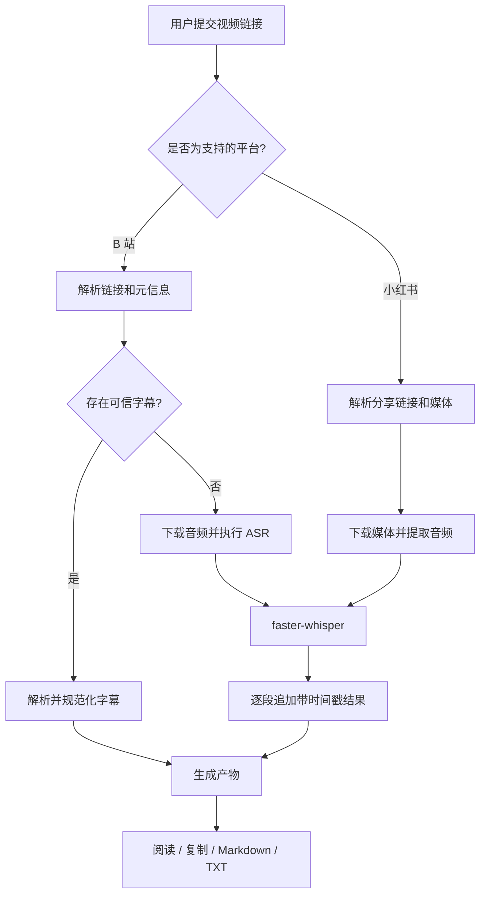
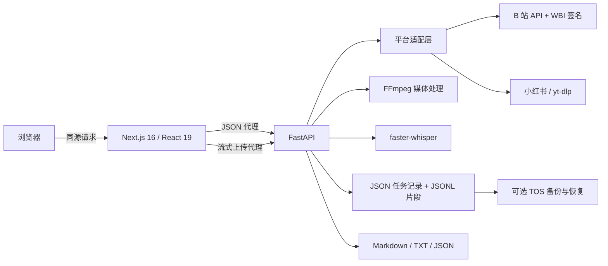

# Link2Transcript｜逐字稿提取器

**把 B 站视频和小红书视频笔记，变成可阅读、可下载的逐字稿。**

[English](README.md) · [在线体验](https://ssam70taea5thtgh9v9q5.apigateway-cn-beijing.volceapi.com) · [产品需求文档](docs/PRD.md)

Link2Transcript 围绕一个完整的产品承诺设计：用户提交支持的视频链接后，应该知道系统正在做什么，能在长任务中看到逐段结果，并最终得到一份可阅读、可复制、可下载的逐字稿。

逐字稿不是终点；它把视频内容转化为可复用的文本 Context，供用户继续与 AI 对话、分析、提问和思考。

它不会把所有输入都强行交给语音识别，而是先判断是否存在可信字幕；只有在字幕不可用时才降级到服务端 ASR，并把实际处理方式明确告诉用户。

> 我负责问题定义、范围控制、工作流设计、关键取舍、验收标准与迭代判断；实现阶段结合分阶段产品/技术文档，由 AI Coding 辅助完成。

## 为什么做这个产品

“把视频变成文字”看似只有一步，真实流程却往往包括：导出平台字幕、下载媒体、提取音频、等待语音识别、整理时间戳，再转换成能继续使用的文件。长任务还会带来另一层问题：用户不知道系统是否还在工作、是否可以离开页面、失败后是否前功尽弃。

因此 V1 真正验证的问题不是“模型能不能转写”，而是：

> 一个非技术用户，能否从支持的视频链接稳定走到“拿到逐字稿”，并在过程中看懂处理路径、进度、失败原因和产品边界？

## 产品体验

1. 粘贴 B 站或小红书链接；也可以直接粘贴包含链接的整段分享文案。
2. 系统校验来源，并自动选择成本更低且可靠的处理路径。
3. 转写片段逐段出现，进度持续可见；用户可以取消任务，已生成文字不会丢失。
4. 成功后可以在线阅读、复制全文，并下载 Markdown 或 TXT。

| 输入 | 当前实际行为 |
| --- | --- |
| B 站单视频 / 指定分 P | 校验 → 优先可信字幕 → 无字幕时转写 |
| 小红书视频笔记 | 解析分享链接 → 下载媒体 → 提取音轨 → 转写 |
| 抖音、播放列表、需要多份产物的合集 | 当前版本明确不支持 |

当前线上产品只接受链接输入。本地上传链路仍保留在代码中，并已用于本地/自托管环境的测试，但受部署网关同步请求体限制，当前 Live Demo 未开放该能力。

## 处理工作流



这是一条有明确分支、失败规则和降级策略的确定性工作流，不是自主 Agent Loop。

## 关键产品决策与取舍

### 1. 字幕优先，语音识别兜底

B 站不少视频已经有人工或平台生成字幕。复用字幕可以避免不必要的算力和等待。真实验收记录中，同一类 15 分钟视频走字幕路径约 **1.27 秒**完成，而 ASR 需要数分钟。

界面仍会明确显示“人工字幕”“AI 字幕”或“语音转写”，因为用户有权知道逐字稿是如何产生的。

但“接口返回了字幕”不等于“字幕可信”。真实测试曾发现平台接口返回其他视频字幕，因此 B 站适配器会校验字幕覆盖时长和片段唯一率；可疑结果不会冒充成功，而会降级到 ASR。

### 2. 用时长控制成本，不只看文件大小

转写成本主要随媒体时长增长。系统会尽可能在下载前读取元信息，并执行可配置的时长上限（默认 2 小时）。文件体积只作为异常输入的安全兜底，不是主要产品规则。

### 3. 长任务必须“过程可见、成果可留”

ASR 每产生一个片段就追加写入 JSONL；前端通过游标只拉取新增片段。页面刷新或服务进程中断，不会抹掉已经完成的文字。

超过 20 分钟的内容采用固定时间窗：每窗 20 分钟、重叠 5 秒、按时间戳去重。这样可以限制内存，又避免依赖“静音切分”——后者在持续背景音乐的视频上真实失败过，找不到可靠切点。

### 4. 部分结果可以读，但不能伪装成完整文件

失败或取消后，已经生成的片段仍可查看；但系统不会生成 Markdown/TXT/result 产物。因为一旦出现下载文件，它很容易被复制、转发或继续喂给其他工具，半成品被误认为完整结果的代价更高。

### 5. 错误提示必须告诉用户下一步做什么

平台受限、没有音轨、没有人声、输入超限、链接无效、下载不完整等情况，都有明确中文提示。界面不会暴露堆栈、凭据或依赖库原始错误。

## AI 与技术设计

### 项目实际使用了什么 AI

运行时真正使用的 AI 能力是 **`faster-whisper` 自动语音识别**（默认 `small`、CPU、`int8`）。核心流程不调用 GPT、Claude、DeepSeek 或其他 LLM，也没有 RAG、自主规划、Memory、Subagent 等运行时模块。

仓库中的 `skill/SKILL.md` 用于记录处理路由和降级规则，便于开发与复用；应用运行时不会加载它。真正执行工作流的是 FastAPI 服务层。

文本后处理刻意保持克制：繁体转简体，并修正规则库中少量经过确认的高频错误；不使用 LLM 润色，避免在用户不知情的情况下改变原意。

### 系统架构



| 层级 | 实际实现 | 选择理由 |
| --- | --- | --- |
| 前端 | Next.js 16、React 19、TypeScript strict、Tailwind CSS v4、zod | 类型明确、接口运行时校验、便于同源部署 |
| API 与编排 | Python 3.11/3.12、FastAPI、Pydantic v2 | 任务契约清晰，并能直接使用媒体与 ASR 生态 |
| 平台处理 | B 站 API + WBI 签名；小红书和备用路径使用 yt-dlp | 避开机房 IP 访问 B 站 HTML 的 412，并隔离不同平台差异 |
| 媒体 | `imageio-ffmpeg` 提供 FFmpeg | 统一为 16 kHz 单声道音频，并支持按窗口切片 |
| 语音识别 | faster-whisper | 本地推理，不依赖外部模型 API |
| 持久化 | 原子写 JSON、append-only JSONL、可选火山引擎 TOS | 当前规模无需先引入数据库，同时支持云端实例恢复 |
| 部署 | 火山引擎 veFaaS、API Gateway、TOS | 前后端函数分离，任务数据可恢复 |

## 状态、恢复与技术边界

任务由显式状态机驱动：

```text
pending → checking_subtitle → [downloading_audio → transcribing] → exporting → succeeded

任意非终态都可能进入 failed 或 cancelled。
```

- 每个片段立即落盘；任务汇总进度按短间隔写回，避免高频整体重写造成写放大。
- 恢复检查点就是已落盘片段的最大结束时间，不额外维护第二份检查点文件。
- 续写从检查点前少量时间重新开始，再按时间戳丢弃重叠部分。
- 后端会交叉核对平台声明时长与实际音频时长，拦截预览片段或静默截断。
- 短链跳转前后都会重新执行域名白名单校验，降低开放重定向与 SSRF 风险。
- 当前有意保持单 worker；并发任务排队，前端显示“前面还有 N 个任务”。

## 验证与迭代

项目按阶段推进：PRD → 技术适配 → 本地核心闭环 → 平台链路 → 实时反馈与恢复 → 正式前端 → 平台扩展 → 云端部署。

当前代码的自动化验证结果：

```text
后端：255 项 pytest 全部通过
前端：类型检查 + lint + 52 项 Vitest + 生产构建全部通过
```

部分真实素材验收证据：

| 场景 | 观察结果 |
| --- | --- |
| 保留的本地/自托管上传链路（Live Demo 未开放） | 61.1 秒视频 → 37 段 → Markdown/TXT；本机测试环境 19.5 秒完成 |
| 保留链路的长内容验证 | 1.05 小时音频 → 2,007 段；磁盘、接口与导出产物段数一致 |
| 带可用字幕的 B 站视频 | 15 分钟内容 1.27 秒完成，不调用 ASR |
| ASR 过程中强制终止服务 | 重启后从已落盘片段续写；验收记录中的重叠区没有重复片段 |
| 小红书 | 150.9 秒内容得到 54 段；1,365 秒样本在线上约 13 分钟得到 480 段 |
| 静音 / 视频无音轨 | 明确失败，不生成任何下载产物 |

自动化测试用于保护接口契约和回归；真实素材则暴露平台反爬、错误字幕、内存压力、上传代理限制与凭据失效等集成问题。两者不能互相替代。

## 当前限制

- 平台支持 B 站和小红书；不支持抖音。
- 当前线上 Demo 只接受链接；本地上传已在代码中实现，可用于本地/自托管环境，但当前线上产品未开放。
- B 站字幕提取依赖有效的服务端登录态；登录态失效时会自动降级到 ASR，因此任务仍可继续，但处理时间会明显增加。
- 当前是单内容、单产物工作流；不支持播放列表或多份产物的合集任务。
- 不支持画面烧录字幕；那需要独立 OCR 链路。
- 不做说话人识别、翻译、总结或语义改写。
- 默认单条时长上限 2 小时，可通过配置调整。
- 小红书媒体提取在云端/机房网络可能依赖其独立的有效平台 Cookie；这与 B 站字幕登录态是两项不同依赖，平台规则变化可能导致解析失效。
- 首次 ASR 可能需要下载或预热模型，因此首个任务更慢。
- 当前单 worker 适合个人作品展示与有限体验，不适合高并发生产流量。

## 后续迭代

- 在更多真实手机上完成响应式复测。
- 增加更清晰的质量提示与可选的人工修订体验。
- 只有在真实使用量出现后，再引入更完整限流和多 worker 调度。
- 把 OCR、说话人识别、下游总结作为独立能力验证，而不是静默扩张“逐字稿”的核心契约。
- 持续把真实线上问题转成可重复的验收案例和回归测试。

## 本地运行

环境要求：Python 3.11+、Node.js 20+；平台链接功能需要联网。FFmpeg 由 `imageio-ffmpeg` 提供，无需单独安装。

### 后端

```bash
python -m venv .venv
.venv/bin/pip install -e .
cp .env.example .env
.venv/bin/uvicorn backend.app.main:app --port 8000
```

API 文档：`http://127.0.0.1:8000/docs`

### 前端

```bash
cd frontend
npm install
cp .env.example .env.local
npm run build
npm start
```

产品页面：`http://127.0.0.1:3100`

### 验证

```bash
.venv/bin/pytest
cd frontend && npm run verify
```

平台 Cookie 与云端凭据都是可选的服务端环境变量。不要把它们写入前端、日志或版本控制。

## 仓库导航

```text
backend/app/api/        任务创建、状态、片段、取消与下载接口
backend/app/services/   工作流、平台、媒体、ASR、持久化与导出
backend/tests/          255 项后端测试
frontend/src/           产品界面、接口客户端、轮询与运行时校验
frontend/tests/         52 项前端测试
docs/PRD.md             公开产品定义与验收标准
skill/SKILL.md          面向人阅读的路由/降级规范；运行时不加载
```

## 使用说明

这是个人作品与技术研究项目。请只处理自己有权使用的内容，遵守平台服务条款与版权规则，不要用于批量抓取。平台解析依赖第三方行为，可能需要持续维护。

MIT License。
